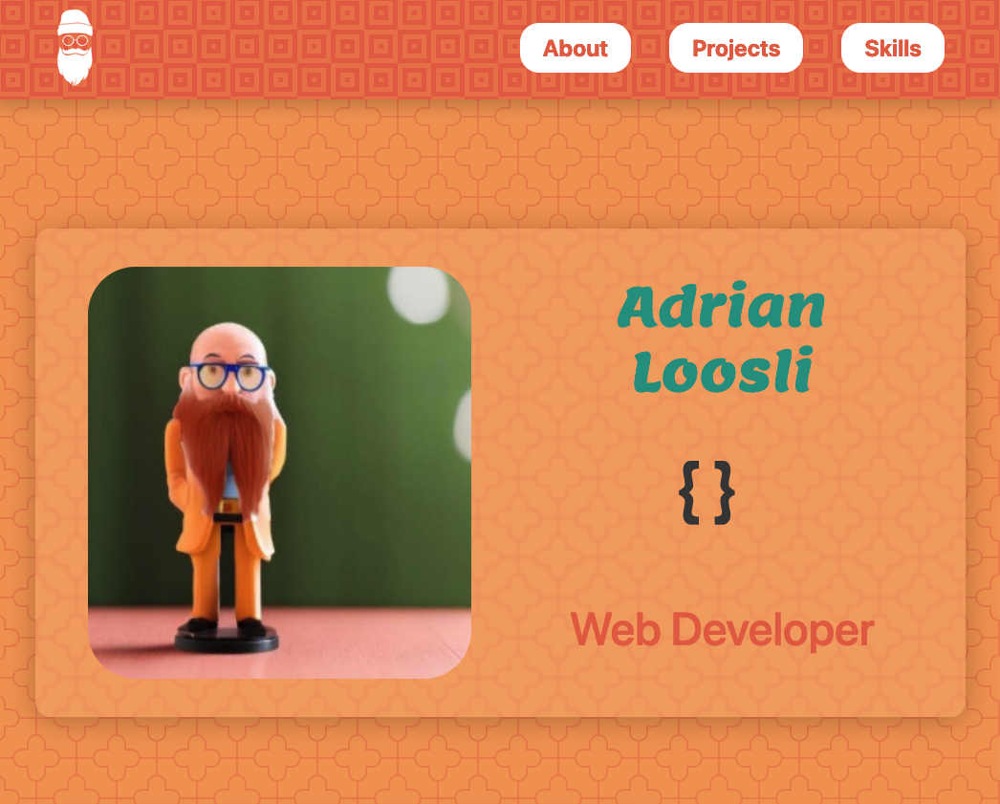

# Bootstrap-Portfolio

## Description

Our task was to create a portfolio website using Bootstrap 4. It contains the few projects we did so far in this bootcamp and some tutorial projects i did by Dev Ed.

## Screenshot

## Deployment
To see it in action, click the badge!
 
 
